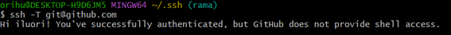

# Creación de una clave SSH

Entro en Web Inicio viendo si estamos en main:

Veo que no tenemos nada pendiente:

Miro cuantos commit tenemos:

Miro si está apuntando a algo:

Ahora quiero ver si tengo una clave persona SSH. Entramos primero en la documentación oficial de GitHub y vamos al apartado correspondiente:

Después de ver que no tengo, volvemos a la documentación al apartado correspondiente que me enseña a generar una clave:

ssh-keygen -t ed25519 -C "email" y me lo genera
Entro en eldirectorio donde se ha guardado la clave y veo si está ahí:

Ahora agrego la clave. Abrimos PowerShell de Windows:

Añado la clave en bash:
cat id_ed25519.pub y me da la clave.
Y copio la clave y en Github la pego en su apartado SHH and GPG keys para guardarla.
Ahora lo pruebo:

